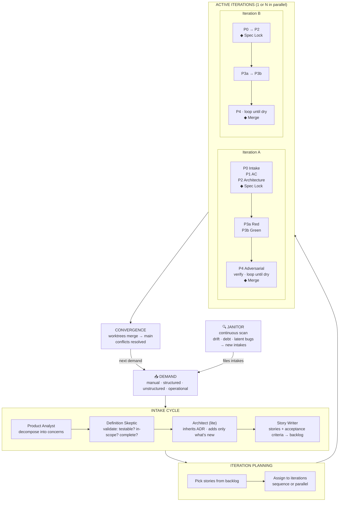

# The Operational Loop

## Mermaid Source



---

## Visual Layout Brief (for designer)

**Canvas:** 1600 × 900px landscape, dark background (#0d1117)

**Flow: left to right, 5 columns**

```
[DEMAND]  →  [INTAKE]  →  [PLANNING]  →  [ITERATIONS]  →  [CONVERGE]
                                                ↑
                                           [JANITOR]
                                         (always on)
```

---

### Column 1 — DEMAND

**Header:** "A demand arrives"
**Four intake forms as chips:**
- 📝 Manual — natural language from developer or stakeholder
- 📋 Structured — spec doc, Jira, Linear, design brief
- 🔍 Unstructured — symptoms, vague goals, contradictory requirements
- ⚙️ Operational — import lib, adopt skill, upgrade dependency

**Bottom note:** "All forms enter the same cycle. Origin does not change governance."

---

### Column 2 — INTAKE CYCLE

**Header:** "Grooming + Architecture + Split"

Three stages as vertical stack with connecting arrows:

```
  1. GROOMING
     ├── Product Analyst
     │   decompose into concerns
     │   identify assumptions
     └── Definition Skeptic
         testable? in-scope? unambiguous?
         → BLOCK if not → return to analyst

  2. ARCHITECTURE LITE
     └── Architect + Adversary
         inherits locked ADR
         adds only new decisions
         pivot? → reopen ADR (human gate)

  3. SPLIT
     └── Story Writer
         1 story = 1 clear objective
         + verifiable AC in Gherkin
         + size: small or medium only
         → stories enter backlog
```

**Gate callout:** "Out-of-scope work is rejected here, not at review time."

---

### Column 3 — ITERATION PLANNING

**Header:** "Pick. Sequence. Activate."

```
  BACKLOG
  ┌─────────────────────────┐
  │  story-A  story-B       │  ← iteration 1 (activate now)
  │  story-C  story-D       │  ← iteration 2 (activate after 1)
  │  story-E ... story-T    │  ← iteration 3 (planned, not yet)
  └─────────────────────────┘

  hssd iteration activate iter-1 iter-2
  → 2 processes, caller orchestrates
```

**Key insight callout:**
> "1 ID → 1 process. N IDs → N parallel processes. No flags, no modes."

---

### Column 4 — ACTIVE ITERATIONS

**Header:** "Each iteration runs its own full loop"

Show 2 parallel tracks side by side:

```
  ITERATION A              ITERATION B
  (worktree-A)             (worktree-B)

  P0 Intake                P0 Intake
  P1 Stories & AC          P1 Stories & AC
  P2 Architecture          P2 Architecture
  ◆ SPEC LOCK ←human       ◆ SPEC LOCK ←human
  P3a Red (fail)           P3a Red (fail)
  P3b Green (pass)         P3b Green (pass)
  P4 Adversarial ──┐       P4 Adversarial ──┐
    independent-   │         independent-   │
    verifier       │ BLOCK?   verifier       │ BLOCK?
    completion-    │ → P3b    completion-    │ → P3b
    challenger     │         challenger     │
    test-adversary │         test-adversary │
    regression-    │         regression-    │
    hunter         │         hunter         │
  ◆ MERGE ←human ◆┘       ◆ MERGE ←human ◆┘
```

**Adversary panel (sidebar):**

| Adversary | What it attacks |
|---|---|
| independent-verifier | Every AC ↔ every test |
| completion-challenger | Proves NOT done |
| test-adversary | Vacuous tests, races |
| regression-hunter | What broke? |
| security-adversary | Injection, auth, leaks |

---

### Column 5 — CONVERGENCE

**Header:** "Worktrees merge to main"

```
  iter-A merged first  → main ✓
  iter-B checks diff   → conflict? resolve → main ✓
  iter-C checks diff   → conflict? resolve → main ✓
```

**Arrow back to Column 1:** "→ next demand"

---

### Always-On Element — JANITOR (bottom strip)

```
┌─────────────────────────────────────────────────────────────────────┐
│  🔍  JANITOR  (continuous, scheduled)                               │
│  Scans: drift · debt · latent bugs · stale conventions              │
│  Deduplicates: same finding never filed twice                       │
│  Output: new operational intakes → enters Column 1                  │
└─────────────────────────────────────────────────────────────────────┘
```

---

## Key Numbers (pull stats for the infographic)

- **2 human gates** per story (Spec Lock + Merge) — everything else is governed automatically
- **5 adversaries** in P4 — each independent, each attacking a different failure mode
- **0 self-certification** — maker ≠ checker is structural, not a guideline
- **N parallel iterations** — `hssd iteration activate id1 id2 ... idN`
- **∞ operational** — the project never finishes, it evolves

---

## Pull Quotes

> "The janitor finds the work. The intake governs it. The iteration delivers it. The adversaries verify it. The human approves it."

> "Parallel fleets of AI agents, each running the full governance loop independently, converging on a shared codebase."

> "Evidence is captured continuously — not reconstructed at the end."
