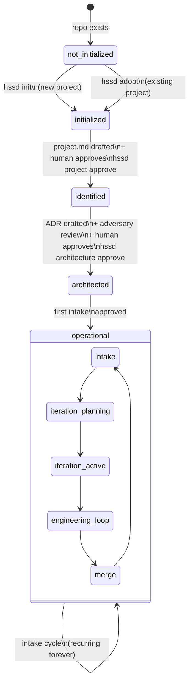

# Project State Machine

## Mermaid Source (renders on GitHub, export via mermaid.live)



---

## Visual Layout Brief (for designer)

**Canvas:** 1200 × 900px, dark background (#0d1117), white text, accent color #58a6ff (blue)

**Left column — Linear Phase Rail (top to bottom):**

```
  ○  not_initialized
     No .harness/ — framework not present
     ↓  hssd init  /  hssd adopt
  ●  initialized
     Framework installed. Understanding the project.
     Reading codebase → drafting project.md → human approves
     ↓  hssd project approve
  ●  identified
     project.md locked. Running architecture.
     Architect → ADR draft → Adversary → Human approves
     ↓  hssd architecture approve
  ●  architected
     ADR locked. Ready for first intake.
     ↓  first intake approved
  ●  operational ──────────────────────┐
     Live. Runs forever. Never "done." │
                                       ↓ (cycle)
```

**Right column — Operational Cycle (circular flow):**

```
        ┌──────────────────────────────┐
        │         OPERATIONAL          │
        │                              │
        │   INTAKE ──────────────────► │
        │     ↑   grooming             │
        │     │   architecture lite    │
        │     │   split → backlog      │
        │     │                        │
        │   ITERATION PLANNING         │
        │     pick stories             │
        │     sequence or parallel     │
        │     │                        │
        │   ITERATION(S) ACTIVE        │
        │     1 id → 1 process         │
        │     N ids → N parallel       │
        │     │                        │
        │   ENGINEERING LOOP           │
        │     P0 → P1 → P2             │
        │     ◆ SPEC LOCK              │
        │     P3 red → green           │
        │     P4 adversarial           │
        │     ◆ MERGE                  │
        │     │                        │
        │   ──┘  next intake           │
        └──────────────────────────────┘
```

**Two creation path callout (top right):**

```
  NEW PROJECT          EXISTING PROJECT
  hssd init           hssd adopt
  │                   │
  Brief → project.md  Read codebase → infer → correct → project.md
  │                   │
  └───────┬───────────┘
          ▼
      initialized
```

**Bottom strip — What cannot happen in each state:**

| State | Cannot happen |
|---|---|
| not_initialized | Nothing — framework is absent |
| initialized | Architecture, intakes, code |
| identified | Intakes, code |
| architected | Code (first intake not yet processed) |
| operational | ADR silent edit · story self-certification · merge without P4 |

---

## Key Callouts (pull quotes for the infographic)

> "The project is never done. Once operational, it evolves through continuous intake cycles."

> "No code before Spec Lock. No merge without evidence."

> "project.md changes rarely. The ADR never changes in-place — only pivots create a new version."
